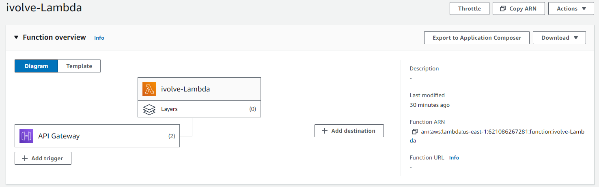
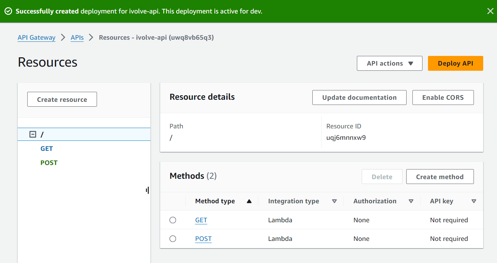
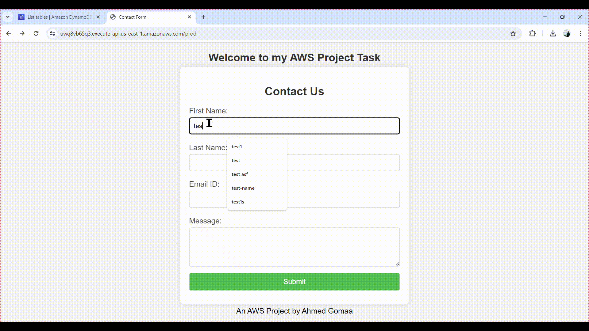

# AWS Project: Serverless Application Development

## Objective

The objective of this project is to build a serverless application using **AWS Lambda**, **API Gateway**, and **DynamoDB**.

---

---

## 1. Setting Up DynamoDB

### Create a DynamoDB Table:

* Navigate to the **DynamoDB** service and click **Create table**.
* Enter **avinshtable** for the table name (this matches the table name used in the Python code).
* Set the primary key as `id` with type **String** (email).
* Configure the read and write capacity settings as needed, then click **Create**.

---

## 2. Creating an AWS Lambda Function and Assigning a Role

### Create a Lambda Function:

* Assign a role with **execution permissions** and **full access to DynamoDB**.
* Navigate to the **Lambda** service and click **Create function**.
* Choose **Author from scratch**.
* Enter **ivolve-Lambda** for the function name.
* Choose the runtime (**Python 3.8**).
* Choose or create an execution role with the necessary permissions to interact with DynamoDB.
* Click **Create function**.
* Upload the Lambda function code as `ivolve.zip`.

---

## 3. Setting Up API Gateway

### Create a REST API:

* Open the **AWS Management Console** and navigate to the **API Gateway** service.
* Click **Create API**.
* Choose **REST API** and click **Build**.
* Enter a name for your API (**ivolve-api**) and click **Create API**.

### Create Resources and Methods:

#### POST Method (to insert items via Lambda):

* Select the **items** resource and click **Create Method**.
* Choose **POST** from the dropdown and confirm.
* Select **Lambda Function** for the integration type.
* Enable **Lambda Proxy integration**.
* Enter the Lambda function name (**ivolve-Lambda**) and click **Save**.
* Confirm the function’s ARN and permissions.

#### GET Method (to fetch items via Lambda):

* Select the **items** resource and click **Create Method**.
* Choose **GET** from the dropdown and confirm.
* Select **Lambda Function** for the integration type.
* Enable **Lambda Proxy integration**.
* Enter the Lambda function name (**ivolve-Lambda**) and click **Save**.
* Confirm the function’s ARN and permissions.

### Deploy the API:

* Click on **Actions** and select **Deploy API**.
* Create a new deployment stage (e.g., `dev`) and click **Deploy**.

Use the **Invoke URL** to access the web app.

---

## Demo

The following video shows the web application integrated with DynamoDB:

---
